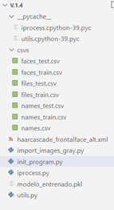
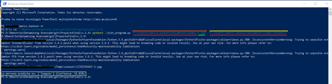

# Readme para proyecto DMA

## Nombre del proyecto: Reconocimiento de caras.

## Descripción del proyecto:

El proyecto cuenta con la implementación de distintas técnicas de DataMining con el objetivo de entrenar un modelo que permita el reconocimiento de una persona a partir de una foto suya. 
Para ello se realizó un proceso de análisis de contexto y preparación de los datos donde se tomaron >200 fotos de los alumnos de la cohorte 23/25 de la Maestría de Ciencias de Datos, con el fin de entrenar el modelo seleccionado. Se realizó la implementación de PCA y distintos modelos de aprendizaje con redes neuronales y diferentes librerías (como ejemplo SKLEARN). 
El resultado final es un programa que cuenta con un modelo pre-entrenado, al cual se le debe cargar una foto. Este la recorta, la convierte a escala de grises y procesa, dando como respuesta una predicción de cuál de las personas conocidas es.

Pasos para ejecutar el programa:
Para correr el programa es necesario contar con Python 3.12 instalado, y las siguientes librerías:
•	Numpy;
•	Pandas;
•	Maths;
•	Joblibs.
Descarga el proyecto en su computadora local, puede realizar tanto una clonación del repositorio como una descarga del mismo. 
Desde una consola, puede ser PowerShell o CMD en el caso de Windows por ejemplo. Ubicamos la carpeta donde se descargó el programa y controlamos que tenga la siguiente estructura:

Como se puede ver aquí se encuentran todas las dependencias necesarias para ejecutar el programa. 

Una vez realizado todos los pasos anteriores se debe contar con una foto (para testeo) y definir una ubicación, es recomendable que se de una ubicación local en su computadora para facilitar el seteo del ambiente.
Se deben definir dos argumentos o parámetros antes de correr el programa:
•	Primer argumento: ruta (path) de la foto a evaluar, esa ruta debe contener la ruta propiamente dicha y el nombre del archivo.
•	Segundo argumento: ruta (path) de la salida, este parámetro debe ser una carpeta en su computadora donde se guardará la foto recortada en escala de grises. 

Como se puede ver, el primer argumento (suprarayado con naranja) es la ruta+foto a evaluar. La ruta es lo subrayado con rojo y la foto lo subrayado con verde. En tanto, el segundo argumento (suprarayado con amarillo) es la ruta de la carpeta destino, donde se guarda la foto recordada en escala de grises.
**EL ORDEN DE LOS ARGUMENTOS SI IMPORTA Y TIENE QUE HABER SOLO DOS.